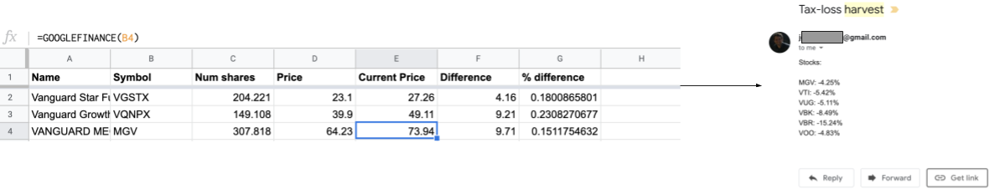

Contributed by Jeremy Glassenberg [Site](https://www.apistrategist.com)

When we purchase a stock and find the value dropped, there's an opportunity to sell that stock, purchase another, and claim a tax deduction.  However, many brokerages don't let you know when you have that opportunity.  

This simple script works with Google Sheets to alert you for free.  Simply copy in your portfolio information, so the sheet knows what stocks you own and at what purchase prices. If anything falls below purchase price, you'll be notified of a tax loss harvest opportunity.

## Technology highlights

- The [`SpreadsheetApp` service][spreadsheetapp-docs] is used to provide stored information to the Apps Script
- [Google Finance formula in Google Sheets](https://support.google.com/docs/answer/3093281?hl=en) are used to check stock prices in real-time and alert the script of changes

## Try it

1. Copy this [sheet][sheet-copy]
2. In the calculations tab make sure your information in colums A through D are up to date
3. Copy and apply this [script] [script-copy] to check for tax-loss harvesting opportunities.  [TODO: confirm if this is needed]
4. Set a trigger for the script to run hourly, or daily, or however frequently you want to check for opportunities.

## Next steps

To get started with Google Apps Script, try out [the codelab][codelab]
which guides you through the creation of your first script.

You can also view the [full source code][github] of this solution on GitHub to
learn more about how it was built.

[script-copy]: https://script.google.com/d/1EnQmcbBeHAvM9vpSOOaVFnuS-XdPvvDFl5CwwQpadqAzgOXICmyM_fzn/edit
[github]: https://github.com/gsuitedevs/solutions/blob/master/
[spreadsheetapp-docs]: https://developers.google.com/apps-script/reference/spreadsheet/spreadsheet-app
[sheet-copy]: https://docs.google.com/spreadsheets/d/1G4VZLU7mSb-cVLXyMfCjM1R5EHQMV8mmRKeZSvXEQsU/copy
